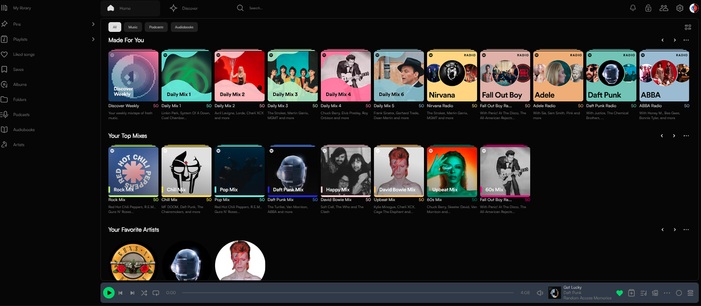
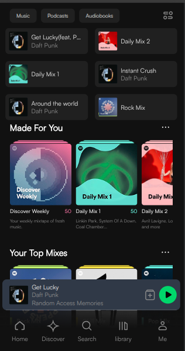

# BugBusters-fy - Music Streaming Web Application

## Description

This project is a music and audio streaming web application inspired by Spotify.  
The application allows users to browse music content such as playlists, albums, and tracks through a modern and responsive user interface.

The main goal of the project is to implement a **frontend markup-based interface**, recreating the structure and layout of a modern music streaming platform using semantic HTML and SCSS.

The project was developed as a **final exam project for a Frontend Web Development course**.

---

## Technologies Used

The application is built using the following technologies:

- **HTML5** – for the structure and semantic markup
- **SCSS (Sass)** – for styling and modular CSS architecture
- **Vanilla JavaScript** – for interactive functionality
- **SCSS Mixins** – to reuse common styling logic
- **Component-based structure** – to organize UI elements

---

## Features

- Fully responsive design that works across **desktop, tablet, and mobile devices**
- Layout built with **CSS Grid** and **Flexbox**
- Responsive behavior implemented with **SCSS** and **media queries**
- Clean and well-structured codebase using a **component-based SCSS architecture**

### Music Player

- Interactive music player
- Play / Pause controls
- Next and Previous track navigation
- Progress bar showing **current playback time and remaining time**
- Volume control with **mute functionality**
- Track information updates dynamically (cover image and song title)

### Dynamic UI Elements

- Song data is loaded from a **JavaScript array**
- UI updates depending on the currently selected track
- **Sidebar popup** that can be opened and closed from header navigation buttons

---

## Installation & Usage

To run this project locally:

1. Clone or download this repo:
   ```bash
   git clone https://github.com/KhatunaKhatuna/BugBusters-fy
   ```
2. Open the index.html file in any modern browser.

---

## Project Structure

```text
project-root
│
├── index.html
├── README.md
├── .gitignore
│
├── css
│ └── style.css
│ └── style.css.map
│
├── scss
│ ├── abstracts
│ │ └── \_fonts.scss
│ │ └── \_mixins.scss
│ │ └── \_placeholders.scss
│ │ └── \_variables.scss
│ │
│ ├── base
│ │ └── \_base.scss
│ │ └── \_reset.scss
│ │
│ ├── components
│ │ ├── \_cardMain.scss
│ │ ├── \_tracklist.scss
│ │ └── \_cardRecent.scss
│ │ ├── \_scrollingTitleGroop.scss
│ │ └── \_cardRecent.scss
│ │ └── \_.......scss
│ │
│ ├── layout
│ │ ├── \_header.scss
│ │ └── \_footer.scss
│ │ ├── \_sideNavbar.scss
│ │ └── \_sidepopup.scss
│ │ └── \_pageLayout.scss
│ │ └── \_.......scss
│ │
│ ├── pages
│ │ ├── \_aboutartist.scss
│ │ └── \_artist.scss
│ │ ├── \_gridalbums.scss
│ │ └── \_home.scss
│ │ └── \_library-liked-songs.scss
│ │ ├── \_library.scss
│ │ └── \_search.scss
│ │ └── \_songsPag.scss
│ │
│ └── main.scss
│
├── js
│ └── script.js
│
├── html
│ ├── aboutartist.html
│ ├── artist.html
│ ├── gridalbums.html
│ ├── home.html
│ ├── library-liked-songs.html
│ ├── library.html
│ ├── search.html
│ └── songsPag.html
│
└── assets
│ ├── audio
│ └── fonts
│ ├── icons
└──── images

```

---

## Team Workflow

This project was developed as a team collaboration project.

## Task Planning

At the beginning of the project the team agreed on:

- application layout and UI structure
- component architecture
- file structure
- coding conventions
- Tasks were managed using GitHub Issues / Task Manager.

---

## Development Workflow

The development process followed these steps:

- Select or create a task in GitHub
- Create a feature branch
- Implement the feature
- Push changes to GitHub
- Create a Pull Request
- Code review by team members
- Merge into main branch

---

## Daily Meetings

The team held two short meetings each day to discuss progress.
Topics discussed during meetings included:

- completed tasks
- tasks in progress
- blockers or technical issues
- pull requests and code reviews
- branch updates

---

Screenshots

### Desktop View



### Mobile View



---

## Contributing

I’m happy to receive suggestions or improvements! Feel free to fork and open a pull request.
